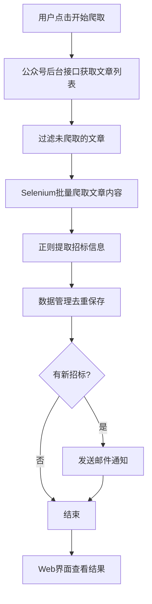

# 微信公众号招标信息爬虫系统 - 产品需求文档 (PRD)

**文档版本**: v1.0
**创建日期**: 2025-11-25
**产品负责人**: -
**目标用户**: 需要跟踪招标信息的企业或个人

---

## 1. 产品概述

### 1.1 背景
企业需要及时获取"取七小服公众号"发布的招标信息，以便参与投标。但手动浏览公众号效率低下，容易错过重要商机。

### 1.2 产品定位
一个自动化的招标信息爬虫系统，能够：
- 批量爬取公众号历史文章
- 自动提取结构化招标信息
- 邮件推送新发现的招标
- 提供Web界面管理和查看

### 1.3 核心价值
- **效率提升**: 自动化批量爬取，节省人工时间
- **信息完整**: 提取关键字段，结构化存储
- **及时通知**: 新招标信息邮件提醒
- **便捷管理**: Web界面查看和管理

---

## 2. 用户需求

### 2.1 目标用户画像
**用户A - 投标专员**
- 需要每天浏览公众号找招标信息
- 希望自动化获取并整理招标信息
- 需要邮件提醒不错过商机

**用户B - 企业管理者**
- 需要了解行业招标动态
- 希望看到结构化的招标数据
- 需要筛选符合条件的项目

### 2.2 用户场景

**场景1: 批量爬取历史招标**
> 作为投标专员，我想批量爬取公众号过去3个月的文章，提取所有招标信息，以便建立项目库。

**场景2: 定期获取新招标**
> 作为投标专员，我希望系统每天自动检查公众号是否有新文章，并提取招标信息，发邮件通知我。

**场景3: 查看招标列表**
> 作为企业管理者，我想通过Web界面查看所有招标项目，按预算、采购人筛选。

---

## 3. 功能需求

### 3.1 核心功能

#### 功能1: 文章列表获取
**优先级**: P0（最高）

**描述**: 通过公众号后台接口(`mp.weixin.qq.com/cgi-bin/appmsg`)获取"取七小服公众号"的文章列表

**输入**:
- 公众号名称: "取七小服公众号"
- 爬取数量: 最多50篇文章（或 `fetch_rule` 指定的数量/天数）

**输出**:
- 文章标题
- 文章URL
- 发布日期
- 文章摘要

**验收标准**:
- [ ] 配置有效的 fakeid/token/cookie 后可以成功请求接口
- [ ] `fetch_rule` 可自由指定“最近 N 天”或“最新 M 篇”
- [ ] 支持关键词过滤与最近 N 天限制
- [ ] 接口异常（ret != 0）能够记录日志或提示用户

---

#### 功能6: 自动调度
**优先级**: P1

**描述**: 允许在配置中设置每日固定时间或固定间隔自动触发爬取

**输入**:
- `scheduler.enabled`
- `scheduler.cron` 或 `scheduler.interval_minutes`

**输出**:
- 定时触发的爬取流程日志

**验收标准**:
- [ ] 可通过配置开启/关闭调度
- [ ] 支持每天固定时间执行
- [ ] 支持按照分钟间隔循环执行
- [ ] 正在运行时下一次调度会自动跳过，避免并发

---

#### 功能2: 文章内容爬取
**优先级**: P0（最高）

**描述**: 使用Selenium批量爬取文章完整内容

**输入**: 文章URL列表

**输出**:
- 文章标题
- 作者/公众号
- 发布时间
- 正文内容(纯文本+HTML)
- 图片列表

**验收标准**:
- [ ] 支持批量爬取(URL列表)
- [ ] 3次重试机制
- [ ] 随机延迟(2-5秒)避免被封
- [ ] 进度回调显示爬取状态
- [ ] 日志记录所有操作

---

#### 功能3: 招标信息提取
**优先级**: P0（最高）

**描述**: 使用正则表达式从文章文本中提取结构化招标信息

**输入**: 文章正文文本

**输出**: 招标信息列表，每条包含：
- **项目名称** (必填)
- **预算金额** (必填)
- **采购人** (必填)
- **获取采购文件时间** (必填)
- 项目编号 (可选)
- 服务期限 (可选)
- 采购内容 (可选)

**提取规则**:
1. 按数字序号分割项目(如"1项目名称"、"2项目名称")
2. 使用正则匹配各字段
3. 验证必填字段完整性
4. 生成唯一ID: `MD5(项目名称+采购人)`

**验收标准**:
- [ ] 能正确识别项目分隔符
- [ ] 必填字段提取准确率 ≥ 95%
- [ ] 可选字段提取准确率 ≥ 80%
- [ ] 验证必填字段，不完整的项目不保存
- [ ] 生成唯一ID用于去重

---

#### 功能4: 数据管理
**优先级**: P0（最高）

**描述**: 管理文章和招标信息的存储、去重、查询

**存储格式**: JSON文件
- `data/articles.json` - 文章元数据
- `data/bids.json` - 招标信息

**核心功能**:
1. 保存招标信息(自动去重)
2. 查询招标信息(支持状态过滤)
3. 检查文章是否已爬取
4. 保存文章元数据

**去重策略**:
- 文章: URL作为唯一标识
- 招标: `MD5(项目名称+采购人)` 作为ID

**验收标准**:
- [ ] 能正确保存和加载JSON文件
- [ ] 去重逻辑正确，不重复保存
- [ ] 支持状态过滤(new/notified/archived)
- [ ] 文件损坏时有错误处理

---

#### 功能5: 邮件通知
**优先级**: P1（高）

**描述**: 发现新招标信息时发送HTML格式邮件

**触发条件**: 爬取完成后，有新的招标信息(status='new')

**邮件内容**:
- 主题: "发现 X 条新招标信息"
- 内容: HTML表格展示招标信息
  - 项目名称
  - 预算金额
  - 采购人
  - 获取文件时间
  - 原文链接

**配置项**:
- SMTP服务器
- 发件人邮箱
- 接收人邮箱列表

**验收标准**:
- [ ] 成功发送HTML邮件
- [ ] 邮件格式美观易读
- [ ] 发送后更新招标状态为'notified'
- [ ] SMTP错误有日志记录

---

#### 功能6: Web管理界面
**优先级**: P1（高）

**描述**: 提供Web界面查看和管理招标信息

**页面设计**:

**6.1 招标信息列表页 (`/`)**
- 顶部导航栏: 系统标题 + "开始爬取"按钮
- 标签页切换: 全部 / 新发现 / 已通知
- 卡片列表展示招标信息
- 每条记录显示:
  - 项目名称(标题)
  - 预算金额
  - 采购人
  - 获取文件时间
  - "查看原文"按钮(跳转到公众号文章)

**6.2 API接口**
- `GET /api/bids?status=new` - 获取招标信息列表
- `POST /api/crawl/start` - 启动爬取任务
- `GET /api/crawl/status` - 查询爬取进度

**技术选型**:
- 后端: Flask
- 前端: Bootstrap + 原生JavaScript
- 样式: 响应式设计

**验收标准**:
- [ ] 页面能正确展示招标信息
- [ ] 标签页切换正常
- [ ] 点击"开始爬取"能触发后台任务
- [ ] 原文链接能正确跳转
- [ ] 响应式布局，支持移动端

---

### 3.2 完整业务流程



---

## 4. 非功能需求

### 4.1 性能要求
- 单篇文章爬取时间 ≤ 10秒
- 50篇文章批量爬取 ≤ 10分钟
- Web页面加载时间 ≤ 2秒
- 招标信息提取准确率 ≥ 95%

### 4.2 可靠性
- 爬虫失败自动重试3次
- 保存数据前备份
- 日志记录所有关键操作
- 异常捕获不导致系统崩溃

### 4.3 易用性
- 配置文件简单清晰(JSON格式)
- Web界面简洁直观
- 操作步骤少(一键爬取)
- 错误提示友好

### 4.4 可维护性
- 模块化设计，低耦合
- 代码注释清晰
- 正则表达式可配置
- 日志便于调试

### 4.5 扩展性
- 支持添加新的字段提取规则
- 支持配置多个公众号
- 预留数据库迁移接口
- 预留定时任务接口

---

## 5. 数据模型

### 5.1 文章元数据 (Article)
```json
{
  "url": "https://mp.weixin.qq.com/s/xxx",
  "title": "文章标题",
  "author": "取七小服公众号",
  "publish_time": "2025-11-25",
  "digest": "文章摘要",
  "crawled_time": "2025-11-25T10:00:00",
  "has_bid_info": true,
  "bid_count": 4
}
```

### 5.2 招标信息 (BidInfo)
```json
{
  "id": "abc123def456",
  "project_name": "桂林银行2025年Oracle数据库维保服务采购项目",
  "budget": "26万元",
  "purchaser": "桂林银行股份有限公司",
  "doc_time": "2025年11月23日－2025年11月28日",
  "project_number": "GYJC2025129",
  "service_period": "1年",
  "content": "为保障oracle数据库的健康运行...",
  "source_url": "https://mp.weixin.qq.com/s/xxx",
  "source_title": "文章标题",
  "extracted_time": "2025-11-25T10:00:00",
  "status": "new"
}
```

### 5.3 系统配置 (Config)
```json
{
  "wechat": {
    "account_name": "取七小服公众号",
    "max_articles_per_crawl": 50
  },
  "email": {
    "smtp_server": "smtp.gmail.com",
    "smtp_port": 587,
    "sender_email": "your_email@gmail.com",
    "sender_password": "your_app_password",
    "recipient_emails": ["recipient@example.com"]
  },
  "scraper": {
    "headless": true,
    "wait_time": 5,
    "retry_count": 3,
    "retry_delay": 5
  }
}
```

---

## 6. 技术选型

| 模块 | 技术栈 | 理由 |
|------|--------|------|
| 文章爬取 | Selenium + Chrome | 能执行JavaScript，处理动态加载 |
| HTML解析 | BeautifulSoup4 | 简单易用，文档丰富 |
| 信息提取 | 正则表达式 | 快速轻量，适合格式规范的文本 |
| 数据存储 | JSON文件 | 无需数据库，简单直接 |
| Web框架 | Flask | 轻量级，快速开发 |
| 前端框架 | Bootstrap + JS | 响应式，开发快速 |
| 邮件发送 | smtplib | Python标准库 |

---

## 7. 风险与挑战

### 7.1 技术风险

| 风险 | 影响 | 概率 | 缓解方案 |
|------|------|------|----------|
| token/Cookie 过期 | 高 | 中 | 及时提示登录失效，提供更新指导，必要时发送告警 |
| 文章格式不统一 | 中 | 高 | 多模式正则匹配；持续优化规则 |
| IP被封禁 | 高 | 低 | 随机延迟；代理池(后期) |
| 公众号文章删除 | 低 | 低 | 记录爬取失败的URL |

### 7.2 合规风险
- **版权问题**: 仅供个人学习使用，不得商用
- **隐私保护**: 不抓取用户评论等隐私信息
- **访问频率**: 控制爬取速度，不对服务器造成压力

---

## 8. 成功指标

### 8.1 上线标准
- [ ] 能成功获取至少30篇文章列表
- [ ] 招标信息提取准确率 ≥ 90%
- [ ] 完整流程可运行(获取列表→爬取→提取→保存→通知)
- [ ] Web界面能正常展示数据
- [ ] 邮件能成功发送

### 8.2 KPI指标
- 每次爬取文章数 ≥ 30篇
- 招标信息提取准确率 ≥ 95%
- 系统可用性 ≥ 95%
- 单次爬取耗时 ≤ 10分钟

---

## 9. 迭代计划

### 版本 v1.0 (MVP)
- 核心功能: 爬取、提取、存储、通知、Web界面
- 预计开发时间: 20-25小时

### 版本 v1.1 (优化)
- 定时任务: APScheduler定时爬取
- 数据导出: 支持导出Excel
- 搜索过滤: Web界面添加搜索和筛选

### 版本 v2.0 (增强)
- 数据库: 迁移到SQLite/MySQL
- 数据分析: 预算分布、采购人统计
- 多公众号: 支持配置多个公众号

---

## 10. 附录

### 10.1 参考资料
- Selenium文档: https://selenium-python.readthedocs.io/
- BeautifulSoup文档: https://www.crummy.com/software/BeautifulSoup/
- Flask文档: https://flask.palletsprojects.com/

### 10.2 示例数据
参考现有文件: `wechat_article.json`

### 10.3 联系人
- 产品负责人: -
- 技术负责人: -
- 测试负责人: -
