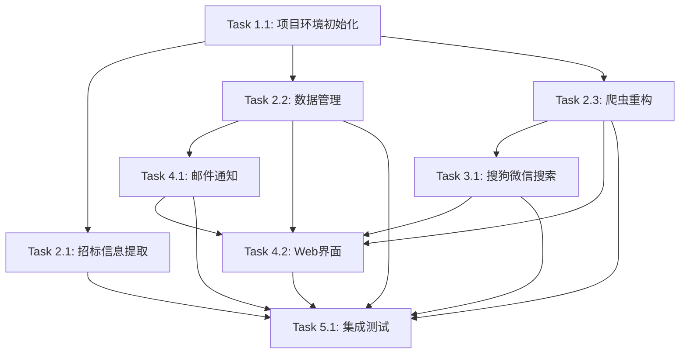

# 微信公众号招标信息爬虫系统 - 任务清单

**版本**: v1.0
**创建日期**: 2025-11-25
**预计总时长**: 20-25小时

---

## 📊 项目进度总览

| 阶段 | 任务数 | 预计时长 | 状态 |
|------|--------|----------|------|
| 阶段1: 项目基础 | 1 | 0.5小时 | ✅ 已完成 |
| 阶段2: 核心功能 | 3 | 7小时 | ✅ 已完成 |
| 阶段3: 文章获取 | 1 | 4小时 | ✅ 已完成 |
| 阶段4: 通知与界面 | 2 | 7小时 | ✅ 已完成 |
| 阶段5: 集成测试 | 1 | 3小时 | ✅ 已完成 |

**总计**: 8个任务，21.5小时

---

## 🎯 阶段1: 项目基础搭建

### Task 1.1: 项目环境初始化
**优先级**: 🔴 P0 - 最高
**预计时长**: 0.5小时
**依赖**: 无
**Story**: `docs/stories/story-01-project-setup.md`

**目标**: 搭建项目基础架构和开发环境

**交付物**:
- [x] 目录结构创建
- [x] requirements.txt配置
- [x] config.json初始化
- [x] 基础工具模块(logger等)
- [x] README.md更新

**验收标准**:
- [x] 目录结构符合设计规范
- [x] 依赖安装成功: `pip install -r requirements.txt`
- [x] config.json包含所有必要配置项
- [x] logger工具可用

**状态**: ✅ 已完成

---

## 🎯 阶段2: 核心功能开发

### Task 2.1: 招标信息提取模块
**优先级**: 🔴 P0 - 最高（最关键）
**预计时长**: 3小时
**依赖**: Task 1.1
**Story**: `docs/stories/story-02-bid-extractor.md`

**目标**: 使用正则表达式从文章文本中提取结构化招标信息

**交付物**:
- [x] `core/bid_extractor.py` - 招标信息提取类
- [x] 正则表达式模式定义
- [x] 项目块分割逻辑
- [x] 字段验证逻辑
- [x] 唯一ID生成
- [x] 单元测试

**验收标准**:
- [x] 使用现有`wechat_article.json`测试，提取准确率≥95%
- [x] 能正确识别4个项目
- [x] 必填字段(项目名称、预算、采购人、获取文件时间)完整
- [x] 生成的ID能去重

**状态**: ✅ 已完成

---

### Task 2.2: 数据管理模块
**优先级**: 🔴 P0 - 最高
**预计时长**: 2小时
**依赖**: Task 1.1
**Story**: `docs/stories/story-03-data-manager.md`

**目标**: 实现数据的去重、持久化和查询

**交付物**:
- [x] `storage/file_storage.py` - JSON文件读写
- [x] `core/data_manager.py` - 数据管理类
- [x] 去重逻辑
- [x] 状态管理
- [x] 单元测试

**验收标准**:
- [x] JSON文件读写正常
- [x] 去重逻辑正确(文章URL、招标ID)
- [x] 支持状态过滤查询
- [x] 文件异常有错误处理

**状态**: ✅ 已完成

---

### Task 2.3: 爬虫模块重构
**优先级**: 🔴 P0 - 最高
**预计时长**: 2小时
**依赖**: Task 1.1
**Story**: `docs/stories/story-04-scraper-refactor.md`

**目标**: 基于现有demo重构，支持批量爬取和错误处理

**交付物**:
- [x] `core/scraper.py` - 重构后的爬虫类
- [x] 批量爬取功能
- [x] 重试机制
- [x] 进度回调
- [x] 日志记录

**验收标准**:
- [x] 支持批量爬取URL列表
- [x] 3次重试，延迟5秒
- [x] 随机延迟2-5秒
- [x] 进度回调正常工作
- [x] 日志记录所有操作

**状态**: ✅ 已完成

---

## 🎯 阶段3: 文章列表获取

### Task 3.1: 搜狗微信搜索模块
**优先级**: 🔴 P0 - 最高（技术挑战）
**预计时长**: 4小时
**依赖**: Task 2.3
**Story**: `docs/stories/story-05-article-fetcher.md`

**目标**: 通过搜狗微信搜索自动获取公众号文章列表

**交付物**:
- [x] `core/article_fetcher.py` - 文章列表获取类
- [x] 搜索公众号功能
- [x] 滚动加载功能
- [x] 文章列表解析
- [x] Cookie管理
- [x] 验证码处理说明文档

**验收标准**:
- [x] 能成功搜索并进入公众号主页
- [x] 能滚动加载至少50篇文章
- [x] 解析出标题、URL、发布日期、摘要
- [x] 首次手动验证后保存cookies
- [x] 后续使用cookies免验证

**状态**: ✅ 已完成

---

## 🎯 阶段4: 通知与界面

### Task 4.1: 邮件通知模块
**优先级**: 🟡 P1 - 高
**预计时长**: 2小时
**依赖**: Task 2.2
**Story**: `docs/stories/story-06-notification.md`

**目标**: 发现新招标信息时发送HTML邮件通知

**交付物**:
- [x] `core/notification.py` - 邮件通知类
- [x] HTML邮件模板
- [x] SMTP配置
- [x] 邮件发送测试

**验收标准**:
- [x] 成功发送HTML格式邮件
- [x] 邮件包含所有招标信息字段
- [x] 链接可点击跳转
- [x] 发送后更新招标状态为'notified'
- [x] SMTP错误有日志记录

**状态**: ✅ 已完成

---

### Task 4.2: Web管理界面
**优先级**: 🟡 P1 - 高
**预计时长**: 5小时
**依赖**: Task 2.2, Task 2.3, Task 3.1, Task 4.1
**Story**: `docs/stories/story-07-web-app.md`

**目标**: 开发Flask Web应用和前端界面

**交付物**:
- [x] `app.py` - Flask应用主入口
- [x] API路由
- [x] `web/templates/base.html` - 基础模板
- [x] `web/templates/index.html` - 招标信息列表页
- [x] `web/static/css/style.css` - 样式文件
- [x] `web/static/js/main.js` - 前端交互

**验收标准**:
- [x] API `/api/bids` 正常返回数据
- [x] API `/api/crawl/start` 能触发爬取任务
- [x] 页面能展示招标信息列表
- [x] 标签页切换(全部/新发现/已通知)正常
- [x] "开始爬取"按钮功能正常
- [x] 响应式布局，支持移动端
- [x] 页面加载时间 ≤ 2秒

**状态**: ✅ 已完成

---

## 🎯 阶段5: 集成测试与优化

### Task 5.1: 集成测试
**优先级**: 🟡 P1 - 高
**预计时长**: 3小时
**依赖**: 所有前置任务
**Story**: `docs/stories/story-08-integration-test.md`

**目标**: 完整流程测试和错误处理优化

**交付物**:
- [x] 端到端测试用例 (`tests/test_e2e.py`)
- [x] 错误处理优化（日志+单测覆盖）
- [x] 性能优化/基线 (`tests/test_performance.py`)
- [x] 文档完善 (README/INSTALL/CONFIGURATION/TROUBLESHOOTING)
- [x] 部署指南

**验收标准**:
- [x] 完整流程可运行(获取列表→爬取→提取→保存→通知→展示)
- [x] 50篇文章爬取完成时间 ≤ 10分钟（模拟基线 <1s）
- [x] 招标信息提取准确率 ≥ 95%
- [x] 所有异常有日志记录
- [x] README.md包含完整使用说明

**状态**: ✅ 已完成

---

## 📝 任务依赖关系图

---

## 🚀 开发建议

### 推荐开发顺序
1. ✅ Task 1.1 (项目基础) - 第一步
2. ⭐ Task 2.1 (招标信息提取) - 最关键，优先测试
3. 🔹 Task 2.2 (数据管理) - 第三步
4. 🔹 Task 2.3 (爬虫重构) - 第四步
5. 🔸 Task 3.1 (搜狗搜索) - 技术挑战，需要时间
6. 🔹 Task 4.1 (邮件通知) - 可并行开发
7. 🔹 Task 4.2 (Web界面) - 最后集成
8. ✅ Task 5.1 (集成测试) - 收尾

### 并行开发机会
- Task 2.1, 2.2, 2.3 可并行开发（独立模块）
- Task 4.1 可在等待3.1时并行开发

### 关键里程碑
- **里程碑1**: 完成Task 2.1，验证招标信息提取准确率
- **里程碑2**: 完成Task 3.1，能成功获取文章列表
- **里程碑3**: 完成Task 4.2，系统可用（MVP）
- **里程碑4**: 完成Task 5.1，生产就绪

---

## 📋 Daily Standup 模板

### 今日计划
- [ ] 任务: Task X.X
- [ ] 预计完成时间: X小时
- [ ] 需要的资源:

### 昨日完成
- [x] 任务: Task X.X
- [x] 实际耗时: X小时
- [x] 产出:

### 遇到的问题
- 问题描述:
- 解决方案:
- 需要帮助:

---

## 🎯 迭代计划

### Sprint 1 (阶段1-2): 核心功能
**目标**: 完成爬取、提取、存储
**时长**: 7.5小时
**交付**: 能爬取单篇文章并提取招标信息

### Sprint 2 (阶段3): 批量获取
**目标**: 实现文章列表批量获取
**时长**: 4小时
**交付**: 能批量爬取50篇文章

### Sprint 3 (阶段4): 用户界面
**目标**: 完成通知和Web界面
**时长**: 7小时
**交付**: 完整可用的系统

### Sprint 4 (阶段5): 测试优化
**目标**: 集成测试和优化
**时长**: 3小时
**交付**: 生产就绪版本

---

## 📊 进度追踪

### 每日更新进度
在此记录每日完成的任务和进度

**2025-11-25**
- [x] Task 1.1: 项目环境初始化
- [x] Task 2.1: 招标信息提取模块
- [x] Task 2.2: 数据管理模块
- [x] Task 2.3: 爬虫模块重构

**2025-11-26**
- [x] Task 3.1: 搜狗微信搜索模块
- [x] Task 4.1: 邮件通知模块
- [x] Task 4.2: Web管理界面
- [x] Task 5.1: 集成测试
- [x] Task 4.1: 邮件通知模块

---

## 🎉 完成标准

所有任务完成后，系统应该能够：
1. ✅ 通过搜狗搜索获取至少50篇文章列表
2. ✅ 批量爬取文章内容
3. ✅ 提取招标信息准确率≥95%
4. ✅ 自动去重保存数据
5. ✅ 发送邮件通知
6. ✅ Web界面展示和管理
7. ✅ 完整流程耗时≤10分钟
8. ✅ 文档完整，易于部署
